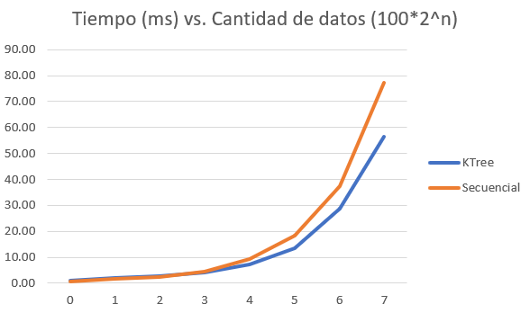
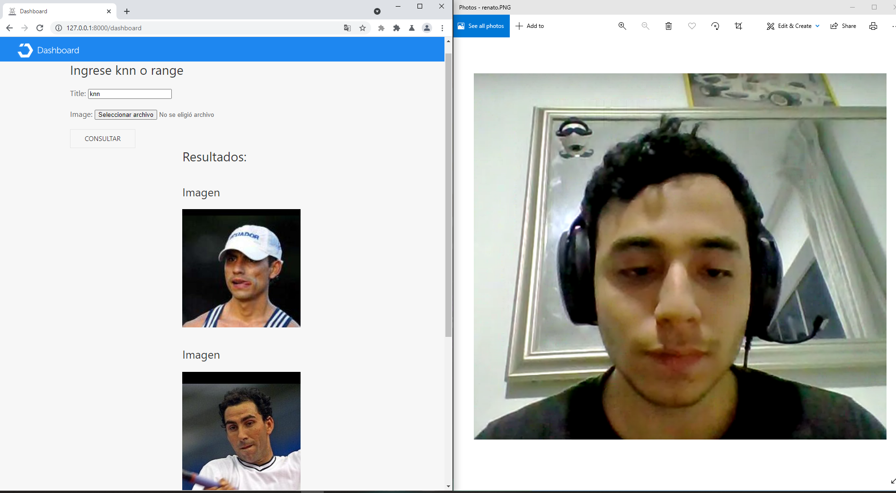
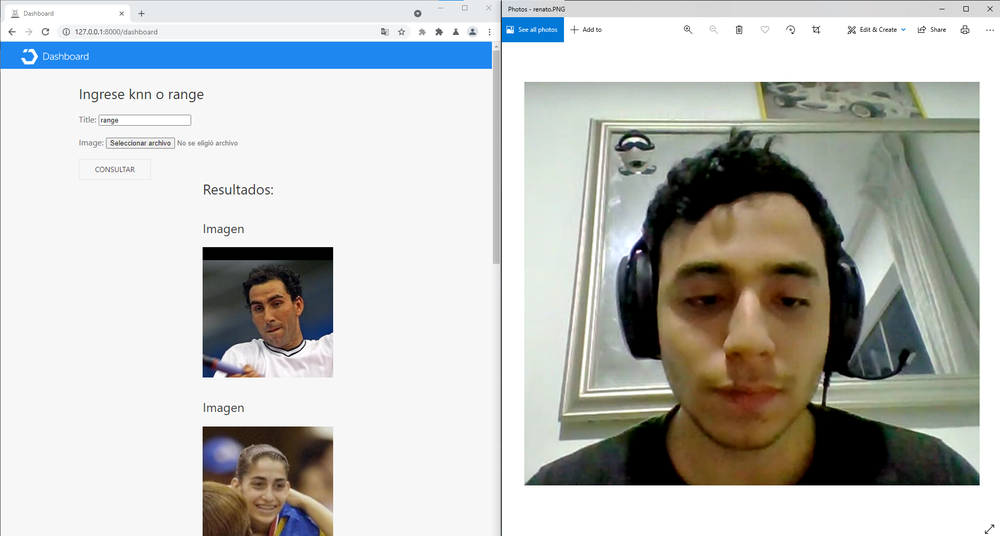

# Proyecto 3: Base de Datos Multimedia
## Objetivos
* Usando la librería _face recognition_ poder construir un índice RTree de vectores representativos de imágenes.
* Implementar el algoritmo de búsqueda KNN para el RTree. 
* Implementar el algoritmo de búsqueda por rango para el RTree.
* Realizar un análisis experimental de ambos algoritmos.
* Construir una aplicación front end para poder usar el motor de búsqueda con facilidad.
## Implementación
### Construcción del índice RTree
La construcción del índice se pudo lograr apoyado de la librería _RTree_ de Python la que nos proporciona con la estructura de datos que soporta _N-Dimension Arrays_ (_ndarray_) de la librería _numpy_. Las imágenes son interpretadas en _face encodings_ que son _ndarrays_ de 128 dimensiones.
```javascript
i = 0
for file in files:
  for face in face_encodings(load_image_file(file)):
    rtindex.insert(i, point2box(face), obj = file.split("/")[-2])
	i += 1
```
Se itera por cada carpeta de la carpeta root indicada como parámetro encontrando todas las imágenes y añadiéndolas al RTree después de ser transformadas en _face encodings_.
### Búsqueda KNN
La estructura de datos RTree cuenta con una función que facilita conseguir el elemento más cercano que es la función _nearest()_, el cual devuelve k elementos más cercanos a un _ndarray_.
```javascript
def knn_search(index: Index, face: np.ndarray, k: int) -> List[str]:
  return [
    n.object
    for n in index.nearest(point2box(face), k, objects=True)
      if n is  not  None  and isinstance(n.object, str)
	]
```
De esta manera se devuelve una lista con todos los elementos válidos encontrados por la función _nearest_ de los primeros _k_ vecinos.
### Búsqueda por rango
De modo similar, se cuenta con la función _intersection()_ que retorna todos los valores que se encuentren en un rango de cercanía específico (_bounding box_).
```javascript
def range_search(index: Index, face: np.ndarray, r: float) -> List[str]:
  return [
    n.object
	for n in index.intersection(bounding_box(face, r), objects=True)
	  if n is  not  None  and isinstance(n.object, str)
]
```
Con esto se consigue todos los objetos válidos dentro del rango _r_.
## Análisis experimental
Para el experimento de prueba se tomo el índice RTree presentado previamente y se puso a comparación con una lista secuencial con los mismos elementos sin indexar. Ambos van a ser sometidos a varias pruebas de búsqueda KNN con diferentes números de datos (100, 200, 400, ..., 12800). 


Como se puede apreciar a gran escala el tiempo de ejecución del RTree es superior al de una búsqueda en una lista secuencial, pero esto recién se empieza a dar cerca del valor N=500, donde previamente la eficiencia de la lista secuencial es superior. Este indicaría que para proyectos con números bajos de elementos no hay necesidad del índice, sin embargo, para asegurarse que una base de datos multimedia sea escalable es indispensable el uso de un índice multimedia.
## Front-End
Para el front-end creamos plataforma con Django, HTML y JavaScript para que un usuario pueda subir imágenes para realizar búsquedas en el índice tanto KNN como por rango.

Búsqueda por KNN.


Búsqueda por rango.

